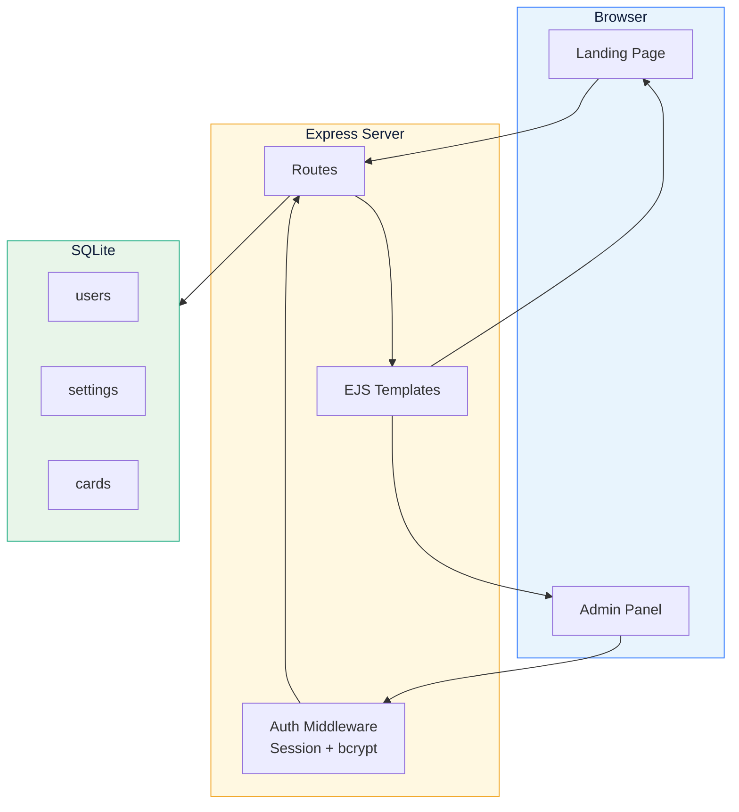

<div align="center">

[](./README.md)


<h1>Department Portal</h1>

<p>
  <strong>Full-Stack Navigation Portal</strong><br/>
  <sub>Node.js + Express + SQLite · Glassmorphism · Zero Config</sub>
</p>

[](LICENSE)

</div>

---

## Introduction

A lightweight landing portal system. Glassmorphism navigation panel on the frontend, with an admin backend for login-protected management of site titles, navigation cards, and custom SVG icons. SQLite database requires zero configuration — start with a single command.

---

## Features

| Feature | Description |
|:---|:---|
| Authentication | Session-based auth with bcrypt password hashing |
| Dynamic Editing | Edit site title & subtitle in admin, instant live update |
| Card Management | Add / delete / edit navigation cards with sort order |
| Icon Presets | 20 built-in SVG icons, one-click selection |
| Custom SVG | Paste any SVG code with real-time preview |
| 6 Color Themes | Blue / Teal / Purple / Orange / Red / Green |
| Responsive | 6 → 4 → 2 column auto-adapt, mobile-friendly |
| Glassmorphism | Frosted glass effect with gradient background |
| Zero Config | SQLite auto-creates database and tables on first run |
| Text Marquee | Card names auto-scroll when exceeding container width |

---

## Architecture



---

## Quick Start

```bash
# Install dependencies
npm install

# Start server
node server.js
```

| URL | Page |
|:---|:---|
| `http://localhost:3000` | Landing Page |
| `http://localhost:3000/admin` | Admin Panel |

**Default Account**

| Username | Password |
|:---|:---|
| `admin` | `admin123` |

> On first run, `data/portal.db` is auto-created with 12 preset navigation cards.

---

## Project Structure

```
department-portal/
├── server.js              # Express entry point
├── db.js                  # DB init & seed data
├── auth.js                # Auth middleware
├── package.json           # Dependencies
├── views/
│   ├── index.ejs          # Landing page
│   └── admin/
│       ├── _header.ejs    # Shared admin navbar
│       ├── login.ejs      # Login page
│       ├── dashboard.ejs  # Dashboard
│       ├── settings.ejs   # Site settings
│       └── cards.ejs      # Card management
├── public/
│   └── admin.css          # Admin styles
├── data/
│   └── portal.db          # SQLite database (auto-generated)
├── .gitignore
├── README.md
└── README_EN.md
```

---

## Database

| Table | Fields | Description |
|:---|:---|:---|
| `users` | id, username, password_hash | Admin accounts |
| `settings` | key, value | Key-value config |
| `cards` | id, title, icon_svg, icon_color, link_url, sort_order | Navigation cards |

---

## Routes

| Method | Path | Auth | Description |
|:---|:---|:---|:---|
| `GET` | `/` | — | Landing page |
| `GET` | `/admin/login` | — | Login page |
| `POST` | `/admin/login` | — | Login action |
| `GET` | `/admin/logout` | — | Logout |
| `GET` | `/admin` | ✅ | Dashboard |
| `GET/POST` | `/admin/settings` | ✅ | Site settings |
| `GET/POST` | `/admin/cards` | ✅ | Card CRUD |
| `POST` | `/admin/cards/:id/update` | ✅ | Update card |
| `POST` | `/admin/cards/:id/delete` | ✅ | Delete card |

---

## Tech Choices

| Layer | Choice | Why |
|:---|:---|:---|
| Runtime | **Node.js** | Lightweight, vast ecosystem |
| Framework | **Express** | Minimal, intuitive routing |
| Template | **EJS** | HTML-like syntax, zero learning curve |
| Database | **SQLite + better-sqlite3** | Single file, no install, sync API |
| Auth | **express-session + bcryptjs** | Session persistence, secure hashing |
| UI | **Glassmorphism** | Modern frosted glass aesthetic |

---

## Preview

```
┌──────────────────────────────────────────────────────┐
│  🔔 Notifications    👤 Welcome                       │
│  ┌────┐  Department Portal                            │
│  │ 🏛 │  Unified Navigation Platform                   │
│  └────┘                                              │
├──────────────────────────────────────────────────────┤
│                                                      │
│   ┌──────┐ ┌──────┐ ┌──────┐ ┌──────┐ ┌──────┐ ┌──────┐ │
│   │ 📁   │ │ 🎓   │ │ 👥   │ │ 💰   │ │ 📦   │ │ 🗄️   │ │
│   │Office │ │Edu   │ │HR    │ │Finance│ │Assets │ │Data   │ │
│   └──────┘ └──────┘ └──────┘ └──────┘ └──────┘ └──────┘ │
│   ┌──────┐ ┌──────┐ ┌──────┐ ┌──────┐ ┌──────┐ ┌──────┐ │
│   │ 📢   │ │ 📅   │ │ 🧪   │ │ 🏢   │ │ 📂   │ │ 🌐   │ │
│   │Notice │ │Meeting│ │Lab    │ │Facility│ │Archive│ │Portal │ │
│   └──────┘ └──────┘ └──────┘ └──────┘ └──────┘ └──────┘ │
├──────────────────────────────────────────────────────┤
│     🛡️ Secure · Standard · Efficient · Service  | © 2024 │
└──────────────────────────────────────────────────────┘
```

---

<div align="center">

## License

MIT · Free to use, modify, and distribute.

</div>
