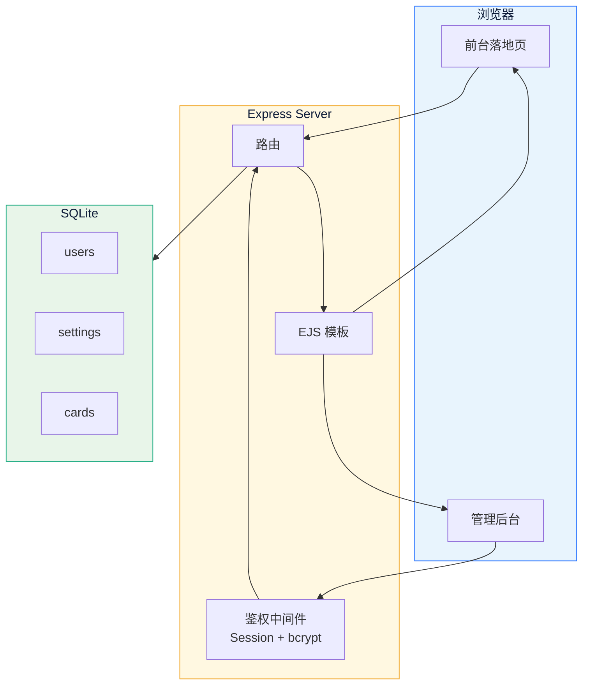

<div align="center">

[](./README.md)


<h1>部门综合服务平台</h1>

<p>
  <strong>全栈导航门户</strong><br/>
  <sub>Node.js + Express + SQLite · 玻璃拟态设计 · 开箱即用</sub>
</p>

[](LICENSE)

</div>

---

## 简介

轻量级落地中转页系统。前端玻璃拟态导航面板，后台支持账号登录管理，可动态编辑网站标题、增删导航卡片、自定义 SVG 图标。采用 SQLite 数据库，免安装零配置，一条命令即可启动。

---

## 功能亮点

| 功能 | 说明 |
|:---|:---|
| 账号登录 | Session 鉴权，bcrypt 密码哈希 |
| 动态编辑 | 标题、副标题后台修改，前台即时生效 |
| 卡片管理 | 增 / 删 / 改导航卡片，排序权重可调 |
| 图标预设 | 内置 20 种 SVG 图标，一键选用 |
| 自定义 SVG | 支持粘贴任意 SVG 代码，实时预览 |
| 6 色主题 | 蓝 / 青 / 紫 / 橙 / 红 / 绿 |
| 响应式 | 6 → 4 → 2 列自适应，手机端完美展示 |
| 玻璃拟态 | Glassmorphism 设计风格，毛玻璃 + 渐变背景 |
| 零配置 | SQLite 免安装，首次启动自动建库建表 |
| 文字滚动 | 卡片名称超出容器自动左右滚动 |

---

## 架构



---

## 快速开始

```bash
# 安装依赖
npm install

# 启动服务
node server.js
```

| 地址 | 页面 |
|:---|:---|
| `http://localhost:3000` | 前台落地页 |
| `http://localhost:3000/admin` | 管理后台 |

**默认账号**

| 账号 | 密码 |
|:---|:---|
| `admin` | `admin123` |

> 首次启动自动创建 `data/portal.db`，并写入 12 张预置导航卡片。

---

## 项目结构

```
落地中转页/
├── server.js              # Express 主入口
├── db.js                  # 数据库初始化 + 种子数据
├── auth.js                # 登录鉴权中间件
├── package.json           # 依赖配置
├── views/
│   ├── index.ejs          # 前台落地页
│   └── admin/
│       ├── _header.ejs    # 后台共用导航
│       ├── login.ejs      # 登录页
│       ├── dashboard.ejs  # 仪表盘
│       ├── settings.ejs   # 网站设置
│       └── cards.ejs      # 卡片管理
├── public/
│   └── admin.css          # 后台通用样式
├── data/
│   └── portal.db          # SQLite 数据库（自动生成）
├── .gitignore
├── README.md
└── README_EN.md
```

---

## 数据库

| 表 | 字段 | 说明 |
|:---|:---|:---|
| `users` | id, username, password_hash | 管理员账号 |
| `settings` | key, value | 键值配置 |
| `cards` | id, title, icon_svg, icon_color, link_url, sort_order | 导航卡片 |

---

## 路由

| 方法 | 路径 | 鉴权 | 说明 |
|:---|:---|:---|:---|
| `GET` | `/` | — | 前台落地页 |
| `GET` | `/admin/login` | — | 登录页 |
| `POST` | `/admin/login` | — | 登录提交 |
| `GET` | `/admin/logout` | — | 退出登录 |
| `GET` | `/admin` | ✅ | 管理后台首页 |
| `GET/POST` | `/admin/settings` | ✅ | 网站设置 |
| `GET/POST` | `/admin/cards` | ✅ | 卡片管理 |
| `POST` | `/admin/cards/:id/update` | ✅ | 更新卡片 |
| `POST` | `/admin/cards/:id/delete` | ✅ | 删除卡片 |

---

## 技术选型

| 层 | 选型 | 理由 |
|:---|:---|:---|
| 运行时 | **Node.js** | 轻量高效，广泛生态 |
| 框架 | **Express** | 最小化框架，路由直观 |
| 模板 | **EJS** | 语法接近 HTML，零学习成本 |
| 数据库 | **SQLite + better-sqlite3** | 单文件免安装，同步 API 简单可靠 |
| 鉴权 | **express-session + bcryptjs** | Session 维持，密码哈希安全 |
| UI | **Glassmorphism** | 现代毛玻璃设计，视觉层次丰富 |

---

## 预览

```
┌──────────────────────────────────────────────────────┐
│  🔔 通知          👤 您好，欢迎登录                    │
│  ┌────┐  部门综合服务平台                              │
│  │ 🏛 │  统一业务导航平台                               │
│  └────┘                                              │
├──────────────────────────────────────────────────────┤
│                                                      │
│   ┌──────┐ ┌──────┐ ┌──────┐ ┌──────┐ ┌──────┐ ┌──────┐ │
│   │ 📁   │ │ 🎓   │ │ 👥   │ │ 💰   │ │ 📦   │ │ 🗄️   │ │
│   │办公系统│ │教务系统│ │人事系统│ │财务系统│ │资产管理│ │数据中心│ │
│   └──────┘ └──────┘ └──────┘ └──────┘ └──────┘ └──────┘ │
│   ┌──────┐ ┌──────┐ ┌──────┐ ┌──────┐ ┌──────┐ ┌──────┐ │
│   │ 📢   │ │ 📅   │ │ 🧪   │ │ 🏢   │ │ 📂   │ │ 🌐   │ │
│   │通知公告│ │会议预约│ │实验室 │ │后勤服务│ │档案管理│ │信息门户│ │
│   └──────┘ └──────┘ └──────┘ └──────┘ └──────┘ └──────┘ │
├──────────────────────────────────────────────────────┤
│     🛡️ 安全 · 规范 · 高效 · 服务  |  © 2024  |  联系我们 │
└──────────────────────────────────────────────────────┘
```

---

<div align="center">

## License

MIT · 自由使用、修改、分发。

</div>
